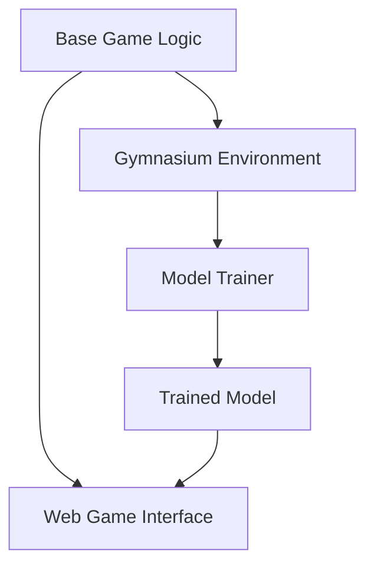

<!-- 

  

 -->

<h1 align="center">RL_DaVinciCode</h1>

A reinforcement learning model for the Da Vinci Code game

<h3 align="center">
  <a href="https://rl-davincicode.streamlit.app/"><b>Play with the model!</b></a>
</h3>

## Table of Contents
- [Structure](#structure)
  - [Base Game Logic](#base-game-logic)
  - [Gymnasium Environment](#gymnasium-environment)
  - [Model Trainer](#model-trainer)
  - [Trained Model](#trained-model)
  - [Web Game Interface](#web-game-interface)
- [Da Vinci Code Game Rules](#da-vinci-code-game-rules)
  - [Objective](#objective)
  - [Game Setup](#game-setup)
  - [Play](#play)
  - [Next Turn / Winning](#next-turn--winning)

## Structure

### Base Game Logic
[Base Game Logic](./game.py) implements the abstracted game classes and methods necessary for the game to function.

### Gymnasium Environment
[Gymnasium Environment](./davinci_code_env_v1.py) utilizes the game logic to create a Gymnasium environment.

### Model Trainer
[Model Trainer](./training_ppo.ipynb) is a PPO trainer modified and refined from [rl_adventure2](https://github.com/higgsfield-ai/higgsfield/blob/main/higgsfield/rl/rl_adventure_2/3.ppo.ipynb).

- Removed the multiple environment parallel training to reduce complexity.
- Adapted to a multi-discrete action space.
- Added a shared network before the actor and critic networks to improve training efficiency and model performance.
- Included additional graphs (correct count, smoothed graphs) for better monitoring.
- Adjusted hyperparameters to optimize model performance.

### Trained Model
[Trained Model](./ppo_model_saves/) contains the saved model object for further use in the web game interface.

### Web Game Interface
[Web Game Interface](./app.py) utilizes the game logic and the [Streamlit library](https://streamlit.io/) to create a web interface for human players. The model is loaded to play against human players. You can try it out on the [Streamlit app deployment](https://rl-davincicode.streamlit.app/).

## Da Vinci Code Game Rules

### Objective
Be the first to expose your opponents' secret codes before your own is fully revealed.

### Game Setup
1. **Tile Arrangement**: 24 numbered tiles divided into two sets:
    - **Dark tiles**: 12 tiles numbered 1-12
    - **Light tiles**: 12 tiles numbered 1-12
2. **Drawing Tiles**:
    - Each player draws 4 tiles at random and hides the numbers.
3. **Sorting Tiles**:
    - Each player sorts their tiles in numerical order from left to right (lowest to highest). For two tiles with the same number, the dark tile is placed to the left of the light tile.

### Play
1. **Drawing a Tile**: On your turn, draw one of the remaining tiles and keep it hidden from other players.
2. **Making a Guess**:
   - Choose an opponent and guess the number of one of their tiles.
   - **Correct Guess**: If you are correct, the opponent will reveal the tile.
   - **Incorrect Guess**: If you are wrong, the tile you drew will be revealed and placed in its correct position. This gives your opponents clues about your hidden tiles.
3. **Continuing Your Turn**: If your first guess is correct, you may either:
   - Attack another opponent's tile.
   - End your turn, in which case the tile you drew will be placed in its correct position without revealing it. Your secret code is now one tile longer.

### Next Turn / Winning
- Play continues in turns. The game continues until only one player has tiles still unrevealed. That player is declared the winner.